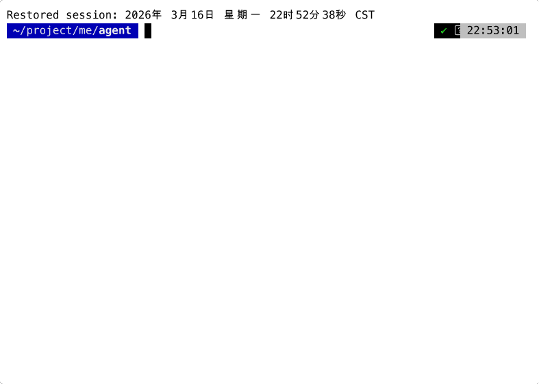

# Codebot

[English](README.md) | [中文](README_zh.md)

Terminal-native AI coding agent. Built on [agentcore](https://github.com/voocel/agentcore), a minimal agent execution kernel.

<p align="center">
  
</p>

## Why

Most AI coding tools are either bloated frameworks or thin API wrappers. Codebot sits in between: a **complete agent** with session management, security policies, and a polished TUI — in under 3000 lines of application code.

The trick: **agentcore handles execution, codebot handles coordination.**

Each layer has one job. No layer knows about the layers above it.

In architecture terms, codebot now acts as a **terminal-native harness** on top of `agentcore`:

- `agentcore` is the execution kernel: agent loop, tools, events, message state
- `codebot` is the harness/runtime layer: prompt composition, session persistence, approval flow, context compaction, runtime reminders, and TUI orchestration

This split matters. The agent loop stays small and reusable, while long-running terminal concerns live in the harness where they belong.

## Features

**Agent**
- Streaming responses with extended thinking (off → xhigh)
- Tool execution: read, write, edit, bash, grep, find, ls, web_search, web_fetch
- Task management: task_create, task_get, task_update, task_list (SubAgent coordination)
- SubAgent delegation with parallel/chain execution
- Automatic context compaction when window fills up
- Multi-provider: Anthropic, OpenAI, OpenRouter, Gemini
- MCP (Model Context Protocol) server integration

**Sessions**
- Append-only JSONL persistence — crash-safe, human-readable
- Resume (`-c` last, `-r` pick), fork at any point, replay
- Model and thinking level restored per session

**Security**
- Four permission modes: `strict` / `balanced` / `accept-edits` / `trust`
- Dangerous command blocking (rm -rf, sudo, dd, ...)
- Workspace-scoped file access
- JSON audit log for every tool decision

**Interface**
- Interactive TUI with real-time streaming and markdown rendering
- Plan mode: agent proposes changes, user reviews and approves
- AskUser: structured multi-choice questions from agent to user
- Image paste (Ctrl+V) with selection (↑) and deletion (Delete)
- Task progress display: progress bar + status icons above input
- Non-interactive print mode for pipes and scripts (`-p`)
- Slash commands: `/model`, `/compact`, `/plan`, `/resume`, `/copy`, ...

**Extensibility**
- Plugin-first architecture with project and user plugin scopes
- Plugin contributions: skills, commands, MCP servers
- `/plugins create`, `/plugins install`, and `/plugins remove` for local plugin lifecycle
- Trust / enable / disable governance with runtime reload

## Installation

**Pre-built binary (recommended):**

```bash
# Linux / macOS
curl -fsSL https://raw.githubusercontent.com/voocel/codebot/main/scripts/install.sh | sh

# Windows (PowerShell)
irm https://raw.githubusercontent.com/voocel/codebot/main/scripts/install.ps1 | iex
```

Or download directly from [GitHub Releases](https://github.com/voocel/codebot/releases).

**With Go:**

```bash
go install github.com/voocel/codebot/cmd/codebot@latest
```

**Build from source:**

```bash
git clone https://github.com/voocel/codebot.git
cd codebot && go build -o codebot ./cmd/codebot
```

## Quick Start

```bash
# Set API key and run
export ANTHROPIC_API_KEY=sk-ant-...
codebot
```

Supported environment variables: `ANTHROPIC_API_KEY`, `OPENAI_API_KEY`, `OPENROUTER_API_KEY`, `GEMINI_API_KEY`. For more options see [settings.example.jsonc](settings.example.jsonc).

OpenRouter can be used as a first-class provider in `settings.json`:

```json
{
  "provider": "openrouter",
  "model": "openai/gpt-5",
  "providers": {
    "openrouter": {
      "api_key": "sk-or-...",
      "base_url": "https://openrouter.ai/api/v1"
    }
  }
}
```

## Usage

```bash
# Interactive TUI
codebot

# Pipe mode
echo "explain main.go" | codebot -p

# Continue last session
codebot -c

# Strict security
codebot --mode strict
```

## Design Principles

1. **Reuse before reinvent** — agentcore does the agent loop, codebot doesn't redo it
2. **No premature abstraction** — every interface has at least two real callers
3. **Convention over configuration** — sensible defaults, explicit overrides
4. **Secure by default** — balanced mode, audit trail, workspace boundaries

## Architecture

Codebot follows a layered coding-agent architecture:

- **Execution kernel (`agentcore`)**: model calls, tool execution, event stream, message lifecycle
- **Harness layer (`codebot`)**: session control, runtime policy, approval routing, prompt assembly, context engineering, recovery, and UX
- **Application surface**: TUI, print mode, slash commands, session resume/fork, configuration

This means codebot is not just "an agent with tools". It is an agent plus a harness for long-running terminal workflows.

## Configuration

Config files: `~/.codebot/settings.json` (global) or `.codebot/settings.json` (project-level, takes precedence).

All fields are optional. See [settings.example.jsonc](settings.example.jsonc) for the full reference with comments.

Plugin authoring guide: [docs/plugins.md](docs/plugins.md). Real example plugins live under `docs/examples/plugins/`, including `review-assistant`, `release-ops`, and `docs-context`.

## Requirements

- API key for at least one provider
- Go 1.25+ (only if installing via `go install` or building from source)

## License

MIT
