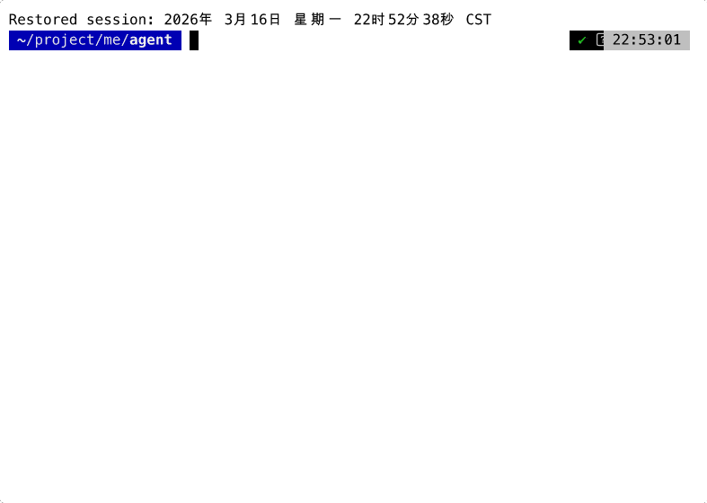

# Codebot

[English](README.md) | [中文](README_zh.md)

终端原生 AI 编程助手。基于 [agentcore](https://github.com/voocel/agentcore) 构建，一个极简的 Agent 执行内核。

<p align="center">
  
</p>

## 为什么

大多数 AI 编程工具要么是臃肿的框架，要么是薄薄的 API 封装。Codebot 介于两者之间：一个**完整的 Agent**，具备会话管理、安全策略和精致的 TUI。

核心思路：**agentcore 负责执行，codebot 负责编排。**

每一层只做一件事，下层不感知上层。

从架构上说，codebot 现在已经形成了清晰的 **Harness 层**，建立在 `agentcore` 之上：

- `agentcore` 是执行内核：Agent 循环、工具调用、事件流、消息状态
- `codebot` 是 Harness / 运行时层：Prompt 组装、会话持久化、审批流，以及 TUI、print、ACP 三个前端

这个分层很重要。Agent 循环保持小而可复用，而长周期终端工作流中的复杂性放在 Harness 层解决。

## 功能

**Agent**
- 流式响应，支持可配置推理强度（off → xhigh）
- 工具执行：read, write, edit, bash, grep, glob, ls, web_search, web_fetch
- Todo 清单：`todo_write` 为多步任务维护可见的清单
- SubAgent 委托，支持并行/链式执行
- 上下文满时自动压缩
- 多 Provider：Anthropic、OpenAI、OpenRouter、Gemini、DeepSeek
- MCP（Model Context Protocol）服务器集成

**会话**
- 仅追加 JSONL 持久化 — 崩溃安全、人类可读
- 恢复会话（`-c` 最近，`-r` 选择）
- 模型和推理强度按会话保存
- 会话格式变更之前（格式 3）保存的会话无法恢复，也不会出现在 `-r` 列表里；不再需要的话可从 `~/.codebot/projects/*/` 删除

**安全**
- 四种权限模式：`strict` / `balanced` / `accept-edits` / `trust`（Shift+Tab 切换）
- 破坏性命令（rm -rf、git reset --hard 等）在审批提示中标出
- 读写凭据、修改 shell 启动文件或 git hooks，在任何模式下每次都要确认
- 工作区范围的文件访问控制
- 每次工具决策的 JSON 审计日志

**界面**
- 交互式 TUI，实时流式输出和 Markdown 渲染
- AskUser：Agent 向用户发起结构化多选问题
- 图片粘贴（Ctrl+V），支持选择（↑）和删除（Delete）
- Todo 清单固定在输入区上方
- 非交互管道模式（`-p`）
- 斜杠命令：`/model`, `/compact`, `/resume`, `/copy`, ...；每个 skill 也是一个 `/` 命令

**扩展**
- plugin-first 架构，支持 project / user 两级 plugin
- plugin 贡献：skills、MCP servers
- 自定义斜杠命令就是 skill：加 `disable-model-invocation: true` 即只供用户调用
- `/plugins create`、`/plugins install`、`/plugins remove` 管理本地 plugin 生命周期
- trust / enable / disable 治理与运行时热刷新

## 安装

**预编译二进制（推荐）：**

```bash
# Linux / macOS
curl -fsSL https://raw.githubusercontent.com/voocel/codebot/main/scripts/install.sh | sh

# Windows (PowerShell)
irm https://raw.githubusercontent.com/voocel/codebot/main/scripts/install.ps1 | iex
```

或直接从 [GitHub Releases](https://github.com/voocel/codebot/releases) 下载。

**通过 Go 安装：**

```bash
go install github.com/voocel/codebot/cmd/codebot@latest
```

**从源码构建：**

```bash
git clone https://github.com/voocel/codebot.git
cd codebot && go build -o codebot ./cmd/codebot
```

## 快速开始

```bash
codebot
```

首次运行会进入配置向导：选择 provider、填写模型 id、粘贴 API Key，全部保存到 `~/.codebot/settings.json`（配置的唯一来源），之后可随时用 `codebot -setup` 重新配置。更多配置项参考 [settings.example.jsonc](settings.example.jsonc)。

OpenRouter 也可以作为一等 provider 使用，在 `settings.json` 中这样配置：

```json
{
  "provider": "openrouter",
  "model": "openai/gpt-5",
  "providers": {
    "openrouter": {
      "api_key": "sk-or-...",
      "base_url": "https://openrouter.ai/api/v1"
    }
  }
}
```

## 使用

```bash
# 交互式 TUI
codebot

# 管道模式
echo "explain main.go" | codebot -p

# 继续上次会话
codebot -c

# 严格安全策略
codebot --mode strict
```

## 设计原则

1. **复用优先** — agentcore 做 Agent 循环，codebot 不重复造轮子
2. **拒绝过早抽象** — 每个接口至少有两个真实调用者
3. **约定优于配置** — 合理默认值，显式覆盖
4. **默认安全** — balanced 模式、审计追踪、工作区边界

## 架构说明

Codebot 采用分层的 Coding Agent 架构：

- **执行内核（`agentcore`）**：模型调用、工具执行、事件流、消息生命周期
- **Harness 层（`codebot`）**：会话控制、审批路由、Prompt 组装、hooks、交互体验
- **应用表层**：TUI、print 模式、ACP、slash 命令、会话恢复、配置

这意味着 codebot 不只是“带工具的 Agent”，而是“Agent + 面向长周期终端工作流的 Harness”。

## 配置

配置文件：`~/.codebot/settings.json`（全局）或 `.codebot/settings.json`（项目级，优先）。

所有字段可选，参考 [settings.example.jsonc](settings.example.jsonc) 了解完整配置项及说明。

Provider 条目支持 `extra`，用于配置连接参数，作为 HTTP/客户端配置发送，不会进入请求体：`user_agent`、`headers`、`anthropic_beta`（`headers` 中显式的 `anthropic-beta` 优先）；Bedrock 不用 `api_key`，改用 `region`、`access_key_id`、`secret_access_key`，可选 `session_token`。

`type` 为 `anthropic` 的 provider 通过工具搜索按需加载工具，这需要 Claude 4.5 或更新的模型；更早的 Claude 模型，以及通过 Anthropic 兼容端点接入的其他厂商模型，可能会拒绝这类请求。

在 Amazon Bedrock 上用 Claude 时，请走 Bedrock 的 Messages API，而不是 Converse：`type: "anthropic"`，`base_url: "https://bedrock-mantle.<region>.api.aws/anthropic"`，`api_key` 填 Bedrock API key，模型 ID 形如 `anthropic.claude-opus-5-5`。它使用 Anthropic 的请求格式，所以和直连 Anthropic 一样，工具通过工具搜索按需加载。Converse 不能延迟加载工具：对话中途加入的工具（比如晚连上的 MCP 服务器提供的）会改动请求，提示缓存会重新开始；对把思考内容绑定在请求前缀上的 Claude 模型（Fable 5.1、Opus 5.5、Sonnet 5.5），请求还可能被拒绝。

上下文窗口、输出上限和价格来自 LiteLLM 的模型列表：codebot 内置一份快照，每天刷新到 `~/.codebot/litellm-models.json`。

OpenAI 协议 provider 还支持 `api: "chat"`（默认）或 `api: "responses"`，用于在 `/v1/chat/completions` 和 `/v1/responses` 之间切换。

`type: "gateway"` 的 provider 是一个 [LiteLLM 网关](https://github.com/voocel/litellm/blob/main/README_CN.md#网关)：codebot 负责运行 agent（比如在沙盒里），`base_url` 处的网关持有 provider key、执行模型调用并计费；`api_key` 是 codebot 访问网关的 token。思考级别、prompt 缓存和重试与直连 provider 时一样有效。

Plugin 开发参考 [docs/plugins.md](docs/plugins.md)。真实示例 plugin 放在 `docs/examples/plugins/`，目前包含 `review-assistant`、`release-ops`、`docs-context`。

## 环境要求

- 至少一个 Provider 的 API Key
- Go 1.25+（仅通过 `go install` 或源码构建时需要）

## 许可证

MIT
